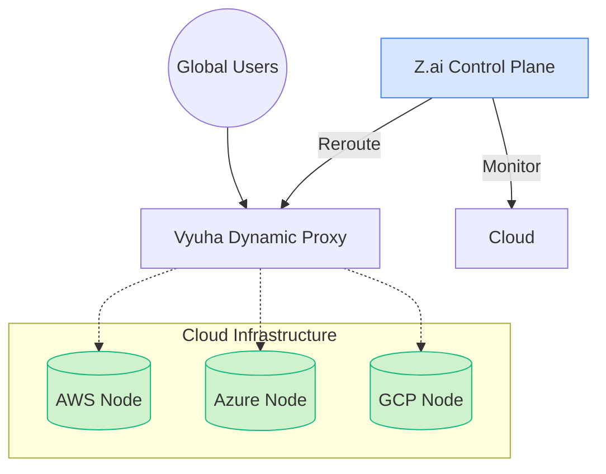

[ignoring loop detection]

  
  <h1>Vyuha AI: Mission Control</h1>
  <h3>Autonomous Multi-Cloud Recovery Orchestrator</h3>
  
<b>Winner Strategy: Triple-Cloud Failover (AWS • Azure • GCP)</b>

  
An intelligent, agent-driven control plane that dynamically routes traffic away from failing data centers using GLM 5.1 long-horizon reasoning.

  

    
    
    
  

   

  
  

---

## 🌌 The Vision
Vyuha AI solves the "Cloud Outage Paradox": In a world of 99.9% SLAs, the remaining 0.1% costs billions. Vyuha AI acts as an **Autonomous SRE**, monitoring **AWS**, **Azure**, and **GCP** nodes simultaneously. When a region goes dark, the **Z.ai Gen-Engine** reasons through it and dynamically reroute traffic before users notice a blip.

### 🧬 Evolutionary Memory
Every failure makes Vyuha smarter. Powered by **GLM 5.1**, the system performs post-incident reflections. If a human operator rejects a proposal, the agent reflects on *why* and stores that lesson in its **Evolutionary Memory**, ensuring it never makes the same mistake twice.

---

## 🏗️ Architecture: The Triple-Cloud Ecosystem

---

## ⚡ Key Features

- **Triple-Cloud Failover**: Simultaneous monitoring and recovery across **AWS (US-East)**, **Azure (West Europe)**, and **GCP (Asia South)**.
- **Neon Diagnostic UI**: A high-impact Next.js dashboard featuring real-time **Green/Red pulses** and a live **Z.ai Gen-Engine Pulse** metrics graph.
- **Chaos Lab**: Built-in experiments to simulate fiber cuts, packet loss, and total datacenter blackouts.
- **Zero-Provisioning Load Generator**: Integrated production load generator providing real-time P99 latency and throughput metrics.
- **Shadow Validation Engine**: AI proposals are sandboxed and simulated before being presented for human approval.

---

## 🚀 Getting Started

### 1. Backend (The Monolith)
We use a **Split-Provider Monolith** strategy to keep deployments $0 cost on Render:
1. Push to GitHub.
2. Create a Render **Web Service**.
3. Add `GLM_API_KEY` to Env Vars.
4. Render uses `scripts/prod_consolidator.py` to spawn the 3 clouds + load tester + proxy + orchestrator in one container.

### 2. Frontend (The Dashboard)
1. Deploy the `dashboard/` directory to **Vercel**.
2. Set `NEXT_PUBLIC_ORCHESTRATOR_URL` to your Render URL.

---

## 🧪 The "Chaos Demo" (How to Judge)
1.  Open **Mission Control** Dashboard.
2.  Observe the **Triple-Cloud Ecosystem** pulsing healthy green.
3.  Navigate to the **Chaos Lab** and kill **GCP** (Hard Kill).
4.  Watch the **Z.ai Gen-Engine** detect the Fatal Error and propose a failover plan.
5.  **Approve** the proposal and watch the traffic graph rebalance instantly.

---

*Built for the Z.ai Hackathon — Engineering Resilient Infrastructure with Long-Horizon Intelligence.*
